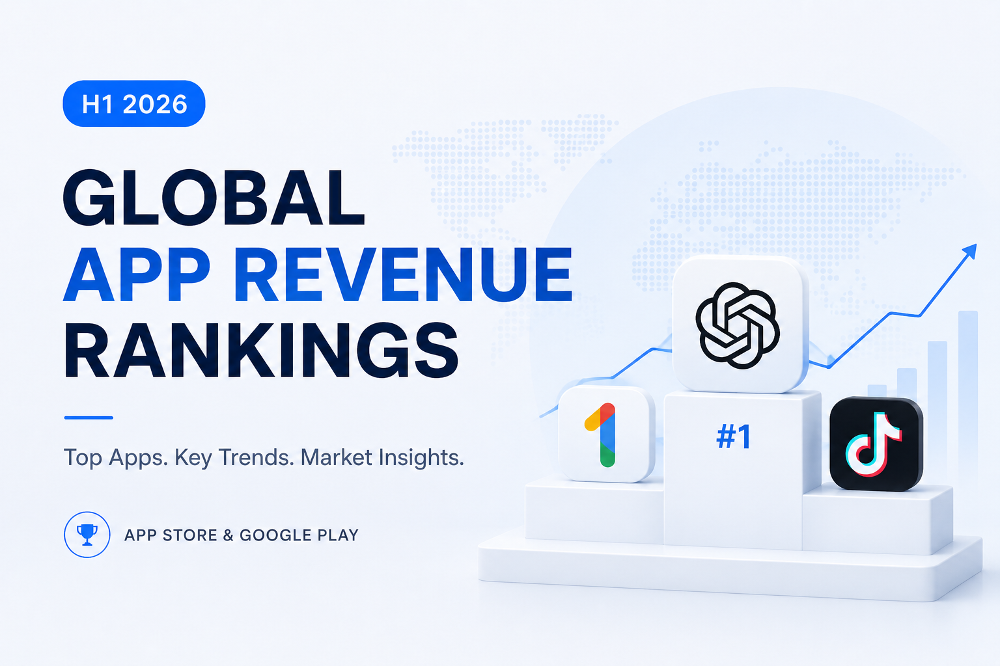
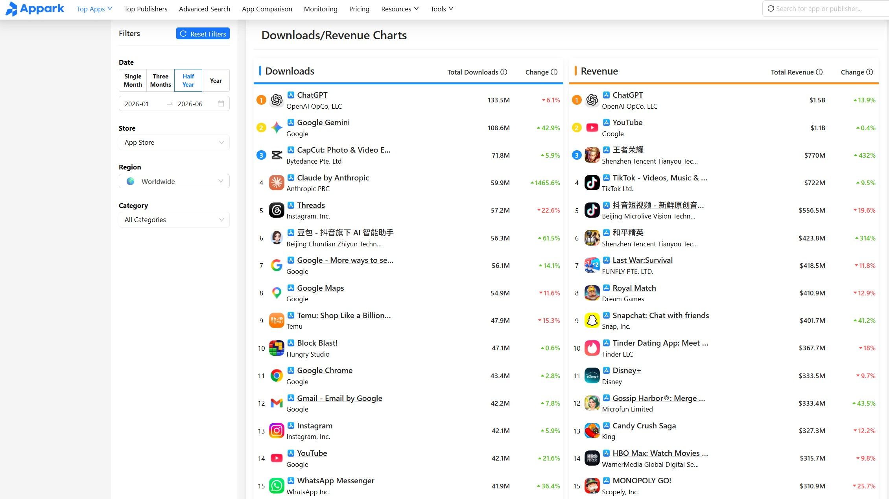

The mobile app market is entering a new stage in 2026.

For years, app success was mainly measured by downloads and user growth. However, the first half of 2026 shows a different trend: the most successful apps are not only attracting users, but also building sustainable monetization models.

AI applications, subscription services, and mobile games continue to dominate global app revenue rankings.

ChatGPT remains the highest-grossing app on the App Store, while Google One becomes the top revenue-generating app on Google Play.

These rankings reveal more than just which apps are making money. They show how user behavior, business models, and market opportunities are changing.

For this analysis, I used [Appark](https://appark.ai/cn/) to study global app revenue rankings, download trends, and publisher performance across App Store and Google Play.

---

## Why Mobile App Revenue Matters in 2026

Building a successful mobile app has become increasingly challenging.

Every year, thousands of new apps enter the market, but only a small percentage achieve sustainable growth.

Looking only at downloads can create a misleading picture.

A high download number does not always mean a successful business.

Revenue data helps answer deeper questions:

- Are users willing to pay?
- Which monetization models are working?
- Which categories have the strongest business potential?
- Why do some apps continue growing while others decline?

By combining revenue rankings, download trends, and competitor movements, we can better understand what makes successful apps different.

---

## Global App Revenue Leaders in H1 2026

The first half of 2026 shows three dominant categories:

- AI applications
- Subscription-based services
- Mobile games

These categories continue to demonstrate the strongest monetization capabilities in the global mobile market.

---

### App Store Revenue Ranking: Top 10 Apps in H1 2026

| Rank | App | Publisher | Estimated Revenue |
| --- | --- | --- | --- |
| 1 | ChatGPT | OpenAI | $1.5B |
| 2 | YouTube | Google | $1.1B |
| 3 | Honor of Kings | Tencent | $770M |
| 4 | TikTok | TikTok | $720M |
| 5 | Douyin Lite | ByteDance | $560M |
| 6 | Game for Peace | Tencent | $420M |
| 7 | Last War: Survival | FUNFLY | $420M |
| 8 | Royal Match | Dream Games | $410M |
| 9 | Snapchat | Snap | $400M |
| 10 | Tinder | Tinder LLC | $370M |

The App Store ranking highlights the strong performance of AI products, entertainment platforms, and premium mobile games.

ChatGPT ranks first with approximately $1.5 billion in estimated revenue.

This shows that AI applications have moved beyond user acquisition and entered a new stage of commercialization.

The competition is no longer only about gaining more users.

The bigger challenge is converting users into long-term paying customers.

ChatGPT’s success demonstrates that AI subscriptions have become one of the most mature monetization models in the mobile ecosystem.

Meanwhile, Tencent’s games continue to perform strongly.

Honor of Kings and Game for Peace remain among the highest-grossing mobile games globally, showing that strong retention systems and long-term operations remain powerful revenue drivers.

---

### Google Play Revenue Ranking: Top 10 Apps in H1 2026

| Rank | App | Publisher | Estimated Revenue |
| --- | --- | --- | --- |
| 1 | Google One | Google | $1.7B |
| 2 | TikTok | TikTok | $616M |
| 3 | ChatGPT | OpenAI | $392M |
| 4 | Last War: Survival Game | FUNFLY | $302M |
| 5 | Coin Master | Moon Active | $279M |
| 6 | Amazon Shopping | Amazon | $278M |
| 7 | Roblox | Roblox Corporation | $260M |
| 8 | MONOPOLY GO! | Scopely | $258M |
| 9 | Gossip Harbor: Merge & Story | Microfun | $216M |
| 10 | Royal Match | Dream Games | $214M |

Google Play presents a different revenue structure compared with the App Store.

Google One ranks first with approximately $1.7 billion in revenue.

This highlights the long-term value of subscription services such as cloud storage and membership products.

At the same time, mobile games occupy more positions in the Google Play ranking.

Products such as Last War, Coin Master, Roblox, and MONOPOLY GO! show that Android remains one of the most important platforms for global mobile gaming revenue.

---

## App Store vs Google Play: Different Monetization Patterns

Although both platforms represent the global mobile ecosystem, their revenue structures are noticeably different.

### App Store: Stronger Subscription and Premium Revenue

The App Store generally performs better in:

- Subscription products
- Premium services
- AI applications
- Entertainment platforms

This is closely related to iOS users’ stronger willingness to pay for digital services.

Many high-value subscription products achieve significant revenue through iOS users.

---

### Google Play: Larger Scale and More Diverse Revenue Sources

Google Play has a broader revenue structure:

- Mobile games
- Shopping apps
- Utility services
- Subscription products

Its larger global user base creates opportunities for apps targeting different regions and user segments.

For global app developers, understanding these platform differences is essential.

A monetization strategy that works well on one platform may not directly work on another.

## Key Trends From H1 2026 Mobile App Revenue Data

Revenue rankings are not only a list of successful apps.

They also reveal where the mobile app market is heading and which business models are becoming more valuable.

---

### AI Apps Are Entering the Monetization Stage

The biggest change in 2026 is that AI applications are moving from rapid growth into sustainable monetization.

In the early stage of AI adoption, many products focused mainly on user acquisition and market awareness.

Today, the competition has changed.

The key question is no longer:

"Who has the most advanced AI model?"

Instead:

"Who can use AI to solve real user problems?"

Leading AI products such as ChatGPT, Gemini, Claude, and other AI assistants are expanding into more specific scenarios:

- Productivity
- Education
- Coding
- Design
- Content creation
- Business workflows

The next generation of successful AI applications will likely not be simple chatbot products.

They will be tools that integrate AI into specific workflows and create measurable value for users.

For developers, the opportunity in AI is still significant, but the focus should move from technology itself to practical user problems.

---

### Subscription Models Continue to Drive Revenue

Looking at the highest-revenue apps in H1 2026, one pattern is clear:

Recurring revenue remains one of the strongest business models.

Apps such as ChatGPT, Google One, YouTube Premium, and Tinder have built strong monetization systems through subscriptions.

Compared with one-time purchases, subscription models provide:

- More predictable revenue
- Higher customer lifetime value
- More resources for continuous product improvement

However, subscriptions are not a guaranteed solution.

A successful subscription product requires:

- Strong user retention
- Continuous product value
- Clear reasons for users to keep paying

The best subscription apps do not simply charge users every month.

They continuously provide enough value to justify long-term usage.

---

### Downloads Do Not Always Equal Revenue

One of the most common mistakes in app research is focusing only on download rankings.

Downloads measure user acquisition.

Revenue measures monetization ability.

These two metrics often tell different stories.

Some apps can achieve millions of downloads but struggle to build profitable businesses.

Other apps may have a smaller user base but generate significant revenue through:

- Subscriptions
- Premium features
- In-app purchases

This is why combining download rankings with revenue rankings provides a more complete understanding of market opportunities.

Growth shows where users are going.

Revenue shows where business value is being created.

---

### Mobile Games Remain a Global Revenue Engine

Despite the rapid growth of AI applications, mobile games continue to be one of the largest sources of app revenue.

The performance of games such as:

- Last War: Survival
- Royal Match
- Coin Master
- MONOPOLY GO!

shows that successful games share several characteristics:

- Strong retention systems
- Regular content updates
- Effective monetization design
- Long-term community operations

The mobile gaming market is highly competitive, but well-designed products can still achieve significant global success.

---

## Publishers Behind Successful Mobile Apps

App revenue is not only about individual products.

Behind many successful apps are companies with strong product development and operational capabilities.

The H1 2026 rankings show continued strength from major publishers:

- OpenAI continues leading the AI category
- Google dominates subscription and ecosystem services
- Tencent remains highly competitive in mobile gaming
- ByteDance continues performing strongly in content platforms
- Dream Games demonstrates the potential of focused game studios

Studying publishers can reveal broader market movements.

A company’s success often comes from a combination of:

- Product strategy
- Distribution capabilities
- User acquisition systems
- Long-term operations

For market researchers and app builders, publisher analysis can reveal emerging opportunities before they become obvious.

---

## Research Methodology: How I Analyze Mobile App Markets

When analyzing mobile applications, I try not to rely on a single ranking.

A complete market analysis usually requires multiple perspectives:

- Revenue trends
- Download growth
- Publisher performance
- Competitor movements
- Category changes
- Historical ranking changes

For this research, I used [Appark](https://appark.ai/cn/) to analyze global app revenue rankings and market trends.

Appark provides insights into:

- Global app revenue rankings
- Download rankings
- Publisher rankings
- Competitor performance
- Market changes over time

Instead of only asking:

"Which apps are successful?"

A more valuable question is:

"Why did these apps succeed?"

Understanding user demand, competitive positioning, and monetization strategies before building a product can significantly improve decision-making.

---

## Final Thoughts

The first half of 2026 reveals several important trends in the mobile app industry:

- AI applications are entering a mature monetization stage
- Subscription businesses continue to create stable revenue
- Mobile games remain one of the strongest revenue categories
- Data-driven market research is becoming increasingly important

The future opportunities in mobile apps will not come only from copying successful products.

The real advantage comes from understanding:

- What users need
- How markets are changing
- Why certain products succeed

Before building an app, understanding the market may be just as important as writing the code.

I will continue sharing insights about mobile app markets, AI development workflows, and product growth strategies.
