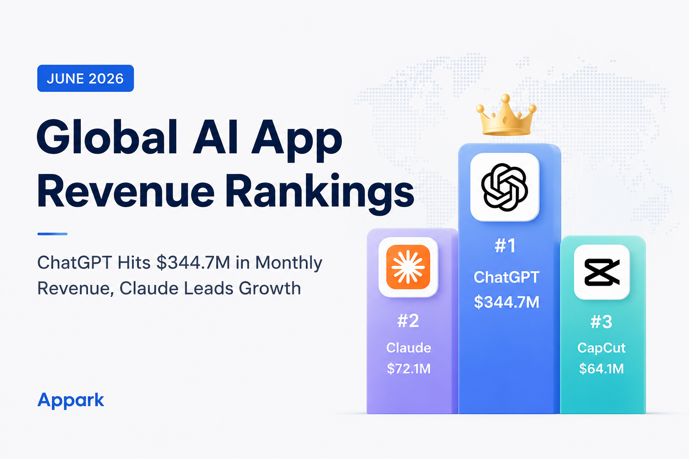
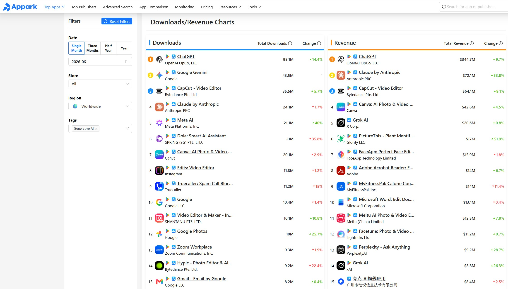
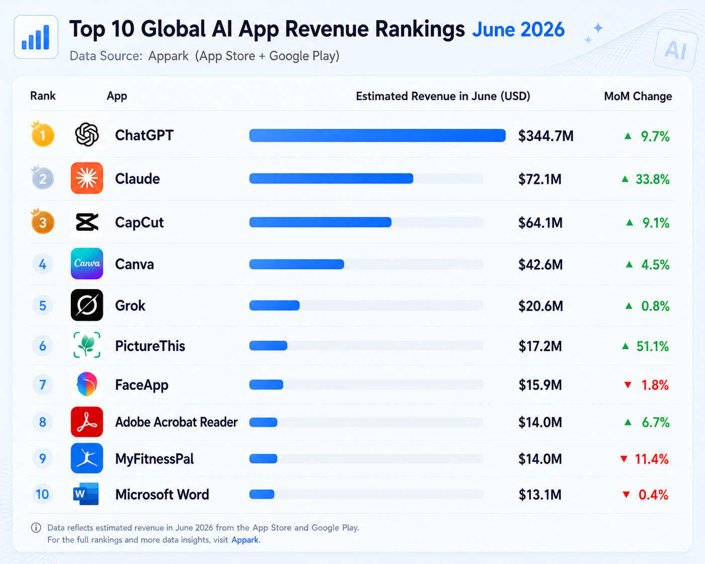

The global AI app market continued to expand in June 2026, but revenue is becoming increasingly concentrated among a handful of leading products.

According to Appark's App Store and Google Play market data, **ChatGPT remained the world's highest-grossing AI app with an estimated $344.7 million in monthly revenue**. Meanwhile, **Claude recorded the fastest growth among major AI apps, increasing 33.8% month over month**.

Beyond the leading AI assistants, products such as CapCut, Canva, Grok, and PictureThis also delivered solid performance, showing that AI monetization is no longer driven by a single product. More vertical AI applications are beginning to build sustainable businesses.

In this report, we'll review the **June 2026 Global AI App Revenue Rankings**, analyze the top-performing AI apps, and explore the latest monetization trends shaping the AI industry.

---

## Global AI App Market Overview

The AI app market continued its strong momentum throughout June.

According to **Appark Top Charts**, ChatGPT remained the clear market leader, followed by Claude, CapCut, Canva, and Grok. While ChatGPT continues to dominate overall revenue, several mid-tier AI products are growing significantly faster.

This suggests that the market is evolving from a winner-takes-all model toward multiple successful AI categories.

### What's Driving Revenue Growth?

Several factors contributed to June's revenue growth across the AI industry:

- **Rapid product innovation.** New AI capabilities continue to increase subscription value. For example, Grok expanded its feature set during June, helping attract additional paying users.
- **Business model optimization.** AI companies are continuously improving pricing strategies and enterprise offerings to increase monetization.
- **Growing brand recognition.** As AI becomes part of everyday work and productivity, leading products continue converting more free users into subscribers.

---

## June 2026 Global AI App Revenue Top 10

Below are the highest-grossing AI apps worldwide in June 2026.

### Key Takeaways

Several trends stand out from this month's rankings.

- **ChatGPT remains the dominant revenue leader**, generating over **$344 million** in estimated monthly revenue.
- **PictureThis recorded the highest growth (+51.1%)**, followed by **Claude (+33.8%)**.
- Vertical AI applications continue gaining momentum while maintaining healthy monetization.

Rather than competing directly with ChatGPT, many AI products are succeeding by solving highly specific user problems.

---

## Top AI Apps Performance Analysis

### Why ChatGPT Continues to Lead

ChatGPT's leadership is supported by three major advantages:

- A massive and growing user base
- Continuous product improvements across multimodal AI
- A strong ecosystem combining consumer subscriptions with developer APIs

For many users, ChatGPT has evolved from a chatbot into a daily productivity tool, making subscriptions increasingly sticky.

### Claude Becomes the Fastest-Growing Major AI App

Claude achieved **33.8% month-over-month revenue growth**, making it one of June's standout performers.

Its growth reflects stronger enterprise adoption, ongoing product improvements, and a more mature commercial strategy. Although its revenue still trails ChatGPT by a wide margin, Claude has firmly established itself among the world's leading AI platforms.

### CapCut, Canva and Grok Continue Growing

AI-powered productivity tools also posted healthy results.

- **CapCut:** $64.1M revenue (+9.1%)
- **Canva:** $42.6M revenue (+4.5%)
- **Grok:** $20.6M revenue (+0.8%)

Unlike general-purpose AI assistants, these products integrate AI directly into existing creative workflows, giving users clear reasons to subscribe.

Although **Perplexity** did not enter the Top 10 by revenue, it continued showing strong growth, highlighting the long-term potential of AI search products.

Developers can also explore similar products through **[Appark Advanced Search](https://appark.ai/en/advanced-search)** to compare revenue, downloads, and rankings.

---

## China's AI Apps Continue Expanding Globally

Chinese AI companies continue gaining international users.

While overseas revenue is still largely dominated by global leaders such as ChatGPT and Claude, several Chinese AI products have demonstrated strong international growth, especially in vertical categories.

Products like **PictureThis** show that solving a focused user problem can create a highly profitable AI business without competing directly against foundation models.

---

## Major AI Industry Trends

### Subscription Remains the Primary Business Model

Most top-grossing AI apps rely heavily on subscription revenue.

Whether it's ChatGPT, Claude, Canva, or CapCut, recurring subscriptions continue to provide stable, predictable income while encouraging continuous product improvements.

### Revenue Is Becoming More Concentrated

June's rankings reinforce an important trend: the largest AI products continue capturing an outsized share of industry revenue.

At the same time, specialized AI applications are emerging as profitable businesses by focusing on narrow but valuable use cases.

### Productivity AI Continues to Outperform

Most of the highest-revenue AI apps help users create content, design, edit videos, write documents, or improve work efficiency.

This suggests that users are more willing to pay for AI that solves practical problems than for purely entertainment-focused experiences.

---

## What Can Developers Learn?

The rankings reveal several opportunities.

- Focus on long-term revenue growth instead of download volume alone.
- Look for vertical AI categories with growing demand but relatively low competition.
- Track competitors over time rather than relying on one-time market snapshots.

With **[Appark Competitor Monitoring](https://appark.ai/en/dashboards/competitor)**, teams can continuously monitor revenue, downloads, and ranking changes to identify new market opportunities.

---

## Frequently Asked Questions

### Where does the revenue data come from?

This report is based on **Appark's App Store and Google Play market estimates**, combined with publicly available industry information. Since estimation methodologies differ across platforms, figures should be used primarily to analyze market trends.

### Why do download rankings differ from revenue rankings?

Downloads measure user acquisition, while revenue depends on conversion rates, subscription pricing, retention, and overall monetization strategy. High download numbers don't necessarily translate into high revenue.

### What is the most common AI monetization model?

Subscription remains the dominant business model across the AI industry. Many leading apps also generate additional revenue through enterprise services and APIs.

### How are Chinese AI apps performing globally?

Chinese AI products continue expanding internationally, particularly in user growth. While global revenue is still led by overseas AI platforms, several Chinese vertical AI apps have demonstrated impressive commercial potential.

---

## Final Thoughts

The AI market evolves rapidly, and a single monthly ranking only captures one moment in time.

What's more valuable is understanding **long-term trends** in revenue, downloads, rankings, and competitive positioning.

If you want to track the global AI app market more closely, **[Appark](https://appark.ai/)** provides continuously updated revenue estimates, download rankings, and competitor insights across both the **Apple App Store** and **Google Play**, helping businesses and creators make better data-driven decisions.
